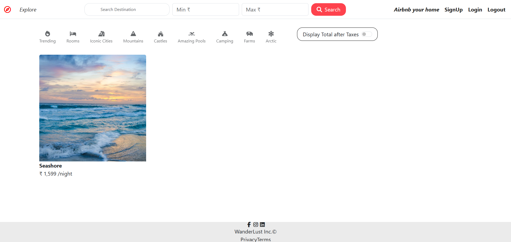
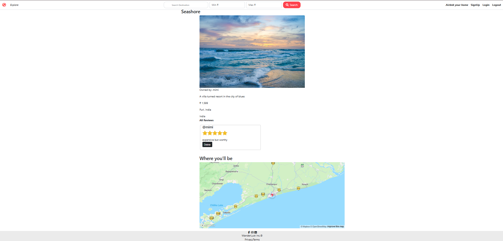
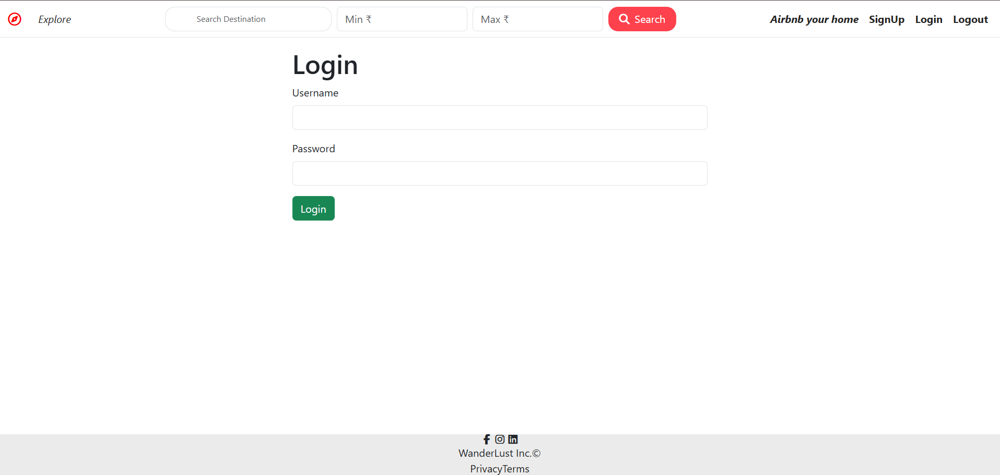
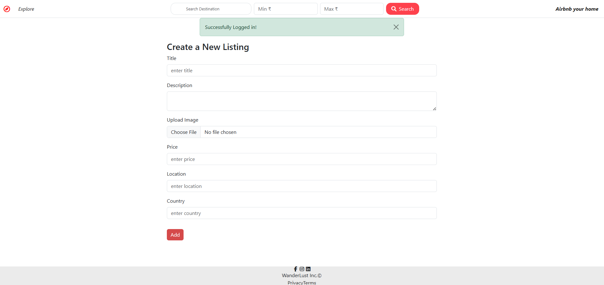

# WanderLust

A full-stack web application inspired by Airbnb that allows users to explore, create, edit, and review property listings. It features secure user authentication, image uploads, interactive maps, and a responsive user interface.

---

## Features

- User Authentication (Sign Up, Login & Logout)
- Create, Edit and Delete Listings
- Upload Listing Images 
- Interactive Maps 
- Add and Delete Reviews
- Authorization (Only owners can edit/delete their listings)
- Responsive Design
- Database provided by MongoDB Atlas
- Deployed Online

---

## Tech Stack

### Frontend
- HTML
- CSS
- Bootstrap 
- EJS Templates

### Backend
- Node.js
- Express.js

### Database
- MongoDB Atlas
- Mongoose

### Authentication
- Passport.js
- Express Session

### Cloud Services
- Cloudinary
- Multer
- Mapbox

### Deployment Service
- Render

---

## Screenshots

### Home Page



### Listing Details



### Login Page



### Add New Listing



---

## Project Structure

```
WanderLust/
│
├── controllers/
├── models/
├── routes/
├── views/
├── public/
├── utils/
├── middleware.js
├── app.js
├── package.json
└── README.md
```

---

## Installation

Clone the repository

```bash
git clone https://github.com/scrpoglow/WanderLust.git
```

Move into the project folder

```bash
cd WanderLust
```

Install dependencies

```bash
npm install
```

Create a `.env` file.

Start the server

```bash
node app.js
```

---

## Environment Variables

Create a `.env` file in the project root.

```env
ATLASDB_URL=your_mongodb_connection_string

SECRET=your_session_secret

CLOUD_NAME=your_cloudinary_cloud_name

CLOUD_API_KEY=your_cloudinary_api_key

CLOUD_API_SECRET=your_cloudinary_api_secret

MAP_TOKEN=your_mapbox_access_token
```

---

## 👨‍💻 Author

**Madhura**

GitHub: https://github.com/scrpoglow
